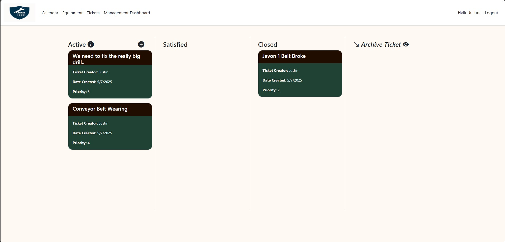
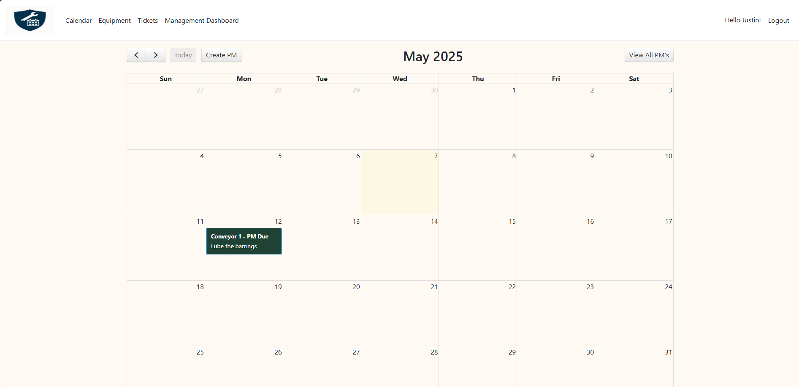

# 🛠️ Maintenance Tracker

Maintenance Tracker is a .NET MVC application designed to streamline the management of equipment and maintenance tasks within an organization. Built with role-based access control, the system supports three distinct roles: **Admin**, **Maintenance**, and **MaintenanceLead**, each with tailored permissions for managing equipment and maintenance tickets.

---

## 🚀 Features
- **Equipment Management**
  - Add, edit, and delete equipment entries with detailed information.
  - Displayed in a Bootstrap card format for quick access.
  - Includes attributes like Name, Assigned Technician, Vendor, Model, Serial Number, Acquired Date, and Warranty Expiration.

- **Kanban-Style Ticket Management**
  - Visual ticket tracking in four categories: **Active**, **Satisfied**, **Closed**, and **Archive**.
  - Drag-and-drop interface for easy ticket movement.
  - Mobile-friendly buttons for changing ticket status.
  - Archive tickets with a collapsible modal for viewing and restoring if needed.

- **Calendar Integration**
  - Visual representation of ticket deadlines and Preventive Maintenance (PM) tickets.
  - Automatically reoccurs monthly upon completion.
  - Manage tickets directly from the calendar view.

- **Role-Based Access Control**
  - Admin, Maintenance, and MaintenanceLead roles to control access and permissions.
  - Integrated with ASP.NET Identity for secure user authentication.

---

## 📷 Screenshots




*(Make sure you add actual images to the `/screenshots` folder in your repo)*

---

## 💡 Technologies Used
- **.NET MVC Framework** – for scalable backend architecture.
- **Entity Framework Core** – for database interactions.
- **Identity Framework** – for role-based authentication and user management.
- **Bootstrap** – for responsive UI components.
- **JavaScript & jQuery** – for interactive features and drag-and-drop.
- **FullCalendar.js** – for intuitive calendar visualization.

---

## ⚙️ Setup Instructions
1. **Clone the repository:**
   ```bash
   git clone https://github.com/yourusername/MaintenanceTracker.git
   cd MaintenanceTracker

2. **Restore dependencies:**
   ```bash
   dotnet restore

3. **Apply migrations for both databases:**
   ```bash
   dotnet ef database update --context ApplicationDbContext
   dotnet ef database update --context ProjectMaintenanceDbContext

4. **Run the application:**
   ```bash
   dotnet run

5. **Access it locally:**
   Open your browser and navigate to https://localhost:5001.

## 🚀 Future Enhancements
- **Dashboard Analytics:**
   - Integration of visual metrics on the homepage to provide insights into:
      - Ticket counts by category (**Active, Satisfied, Closed, Archived**).
      - The total number of **Preventative Maintenance (PM)** tickets.
      - Upcoming maintenance schedules for better planning and resource allocation.
- **Predictive Maintenance Insights:**
   - Leverage historical data to predict equpiment failures and recommend maintenance schedules proactively.
- **Enhanced Reporting Tools:**
   - Generate detailed reports on maintenance history, technician workload, and equipment lifecycle.